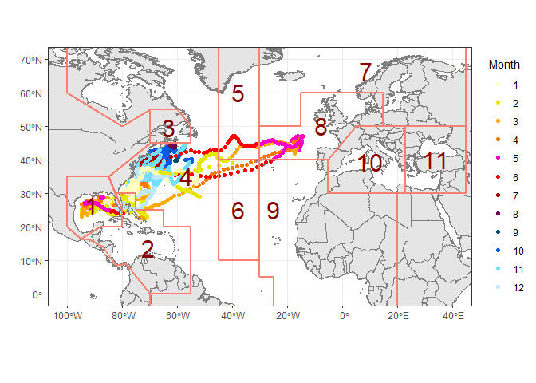
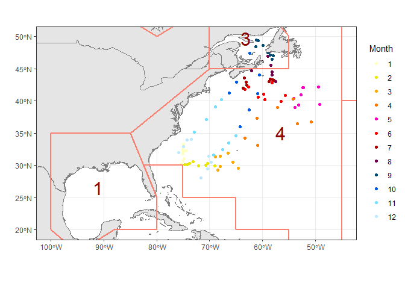
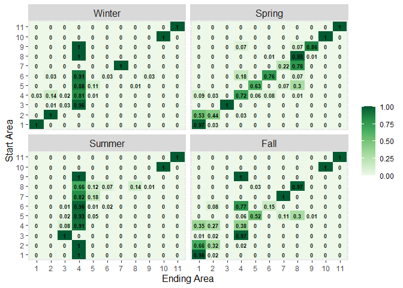

# SatTagSim

<!-- badges: start -->
[](https://galuardi.github.io/SatTagSim/)
[](https://github.com/galuardi/SatTagSim/actions/workflows/R-CMD-check.yaml)
[](https://www.gnu.org/licenses/gpl-3.0)
[](https://github.com/galuardi/SatTagSim)
<!-- badges: end -->

**SatTagSim** is an R package for spatially and temporally explicit simulation of marine animal movement derived from electronic tagging data. It provides an advection-diffusion modeling framework with environmental constraints (e.g., sea surface temperature and land boundaries) to translate individual tracks into population-level movement and seasonal transition matrices across discrete spatial strata.

These movement matrices are formatted for direct use in spatially structured stock assessment models, operational population dynamics models, and Management Strategy Evaluations (MSE).

---

## Key Features

- **Advection-Diffusion Simulation**: Simulates tracks using directional advection ($u, v$) and random diffusion ($D$) parameters with environmental suitability masking.
- **Parallel Processing**: Vectorized and parallel simulation workflows via [`sim_tracks_par()`](https://galuardi.github.io/SatTagSim/reference/sim_tracks_par.html).
- **Spatial Stratification**: Automated assignment of simulated positions to custom polygon stratifications (e.g., 2-box, 7-box, 8-box, 11-box models).
- **Markov Transition Matrices**: Computes seasonal transition probability matrices and transition rates between strata.
- **Goodness of Fit & Variance**: Multinomial variance estimation and $\chi^2$ goodness-of-fit tools for matrix validation.

---

## Installation

Install the latest development version of **SatTagSim** from GitHub:

```r
# Using pak (recommended)
# install.packages("pak")
pak::pak("galuardi/SatTagSim")

# Or using remotes
# install.packages("remotes")
remotes::install_github("galuardi/SatTagSim")
```

---

## Workflow Overview

### 1. Electronic Tag Data

Data typically originate from state-space geolocation models (e.g., Kalman filter track estimates). The package includes track data from 31 Atlantic bluefin tuna tagged off Nova Scotia, Canada (Galuardi et al. 2010):

<p align="center">
  
</p>

### 2. Track Simulation

Simulations translate individual electronic tag observations into broader distribution dynamics using monthly advection, diffusion, and environmental suitability masks:

<p align="center">
  
</p>

### 3. Transition Matrices

Markovian transition matrices quantify the proportion of simulated fish moving between discrete spatial areas across seasons:

<p align="center">
  
</p>

---

## Quickstart

```r
library(SatTagSim)

# Load pre-simulated dataset and 7-box spatial strata
data(sim_example)
data(box7)

# Stratify simulated tracks into spatial boxes
datbox <- get.first.box(simdat, nsim = 1000, box = box7, seas.len = 24)

# Calculate seasonal transition probability matrices
boxtrans <- get.trans.prob(datbox, nyears = 50, adims = c(7, 7, 4), perc = TRUE)
names(boxtrans) <- c("Winter", "Spring", "Summer", "Fall")

# Plot seasonal transition matrices
plot.boxtrans(boxtrans, palette = "Greens", text.size = 3.5, text.col = "black")
```

---

## Built-in Datasets

| Dataset | Class | Description |
| :--- | :--- | :--- |
| `nsfish` | `data.frame` | Atlantic bluefin tuna satellite track positions (Galuardi et al. 2010) |
| `sim_example` | `list` / `data.frame` | Pre-computed simulations (`simdat` and `simdatdf`) |
| `box2`, `box7`, `box8`, `box11` | `SpatialPolygonsDataFrame` | Spatial stratification boundaries for Atlantic operational models |
| `rmask` | `RasterStack` | Monthly habitat suitability masks based on World Ocean Atlas SST |
| `woasst` | `RasterStack` | World Ocean Atlas monthly mean SST climatologies |
| `bath` | `SpatialGridDataFrame` | ETOPO1 bathymetry raster |
| `myramps` | `list` | Standard oceanic and bathymetric color palettes |

---

## Documentation

Full documentation, function reference, and interactive vignettes are available on the [pkgdown documentation site](https://galuardi.github.io/SatTagSim/):

- [Simulate using SatTagSim (Nova Scotia Bluefin Tuna)](https://galuardi.github.io/SatTagSim/articles/sim_ns.html)
- [Movement Matrix Goodness of Fit](https://galuardi.github.io/SatTagSim/articles/matrix_variance.html)

---

## References

- Galuardi, B., Royer, F., Golet, W., Logan, J., Neilson, J., & Lutcavage, M. (2010). Complex migration routes of Atlantic bluefin tuna question current population structure paradigm. *Canadian Journal of Fisheries and Aquatic Sciences*, 67(6), 966–976.
- Kerr, L. A., Cadrin, S. X., Secor, D. H., & Taylor, N. (2016). Modeling the implications of stock mixing and life history uncertainty of Atlantic bluefin tuna. *Canadian Journal of Fisheries and Aquatic Sciences*, 74(11), 1990–2004.
- Lauretta, M. V., Hanke, A., Natale, A. D., & Quílez-Badia, G. (2016). Atlantic bluefin tuna electronic tagging data summary. *Collect. Vol. Sci. Pap. ICCAT*, 72(7), 1715–1728.
- Sibert, J. R., Musyl, M. K., & Brill, R. W. (2003). Horizontal movements of bigeye tuna (*Thunnus obesus*) near Hawaii determined by Kalman filter analysis of geolocation data. *Fisheries Oceanography*, 12(3), 141–151.
- Sibert, J. R., Lutcavage, M. E., Nielsen, A., Brill, R. W., & Wilson, S. G. (2006). Interannual variation in large-scale movement of Atlantic bluefin tuna (*Thunnus thynnus*) determined from pop-up satellite archival tags. *Marine Biology*, 150(1), 131–145.
