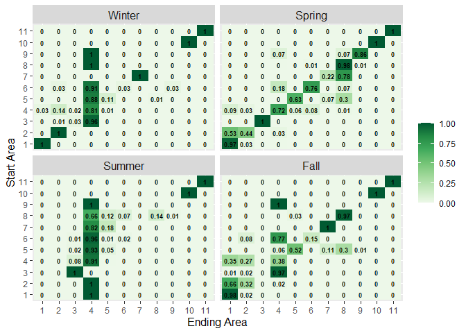

SatTagSim Homepage
================
Benjamin Galuardi

## SatTagSim

`SatTagSim` is a package for R statistical software designed to produce
spatial and temporally explicit simulations and movement summaries of
fish based on electronic tagging results. The movement simulation is
based on an advection diffusion framework and includes environmental
constraints which may be tailored to those of the study organism. The
primary product of the package are sets of movement matrices that
summarize population level movement between discrete areas of the ocean.
These matrices are designed to be used in a variety of spatially
explicit operational and stock assessment models and management strategy
evaluations.

## Installation

## Tag Data

Data required for using this package are estimated tracks and associated
uncertainty parameters, typical of those generated by state space
geolocation models. An example dataset of 31 Atlantic bluefin tuna,
tagged off Nova Scotia, Canada (Galuardi et al. 2010), are included in
this package.

<!-- -->

## Simulations

The primary goal of simualtion from electronic tag data is to gain
population level inferences from individual information. Population
level information is typically more usful for assessment and management
applications while indivudal data are more usful for biologically
focused study.

Simulations are produced using advection and diffusion parameters,
typically estimated from Kalman filter geolocation estimation (J. R.
Sibert, Musyl, and Brill 2003). The concept was illustrated in (John R.
Sibert et al. 2006).

<figure>

<figcaption aria-hidden="true">Example Simulation, two years, four
points/month</figcaption>
</figure>

## Movement Matrices

A key output of this package are Markovian movement matrices. These
matrices indicate percentages of simulated fish that moved between
starting and ending areas during seasonal time steps.

<!-- -->

## Vignette

`SatTagSim` includes a vignette outlining all steps in a typical
simulation run. To facilitate knitting, and example simulation result is
included in the package datasets. At the time of writing, the vignette
*should* knit, but it is better for a new user to step through the
vignette. The setup of summary movement parameters from tag data, for
example, is quire involved. The package has not been tested on a Mac
either. Linux is lovely though.

## Other Data in `SatTagSim`

- bath : ETOPO1 bathymetry

- data bath.colors (myramps) : color ramp

- bath.colors2 (myramps) : color ramp

- box11 Spatial Strata

- box2 Spatial Strata

- box7 Spatial Strata

- box8 Spatial Strata

- jet.colors256 (myramps): color ramp

- land.colors (myramps) : color ramp

- month.colors (myramps) : color ramp

- nsfish : Atlantic Bluefin Tuna tag data

- rmask :Raster mask of World Ocean Atlas SST

- simdat : Examples simulations (list)

- simdatdf : Example simulations (data frame)

- woasst : Raster mask of World Ocean Atlas SST

## References

Galuardi, B., F. Royer, W. Golet, J. Logan, J. Nielson, and M.
Lutcavage. 2010. “Complex Migration Routes of Atlantic Bluefin Tuna
Question Current Population Structure Paradigm.” *Can J. Fish. Aquat.
Sci* 67 (6): 966–76.

Sibert, J. R, M. K Musyl, and R. W Brill. 2003. “Horizontal Movements of
Bigeye Tuna Near Hawaii from Archival Tagging Data.” *Fisheries
Oceanography* 12: 141–51.

Sibert, John R, Molly E Lutcavage, Anders Nielsen, Richard W Brill, and
Steven G Wilson. 2006. “Interannual Variation in Large-Scale Movement of
Atlantic Bluefin Tuna (Thunnus Thynnus) Determined from Pop-up Satellite
Archival Tags.” *Canadian Journal of Fisheries and Aquatic Sciences* 63
(10): 2154–66. <https://doi.org/10.1139/f06-114>.

